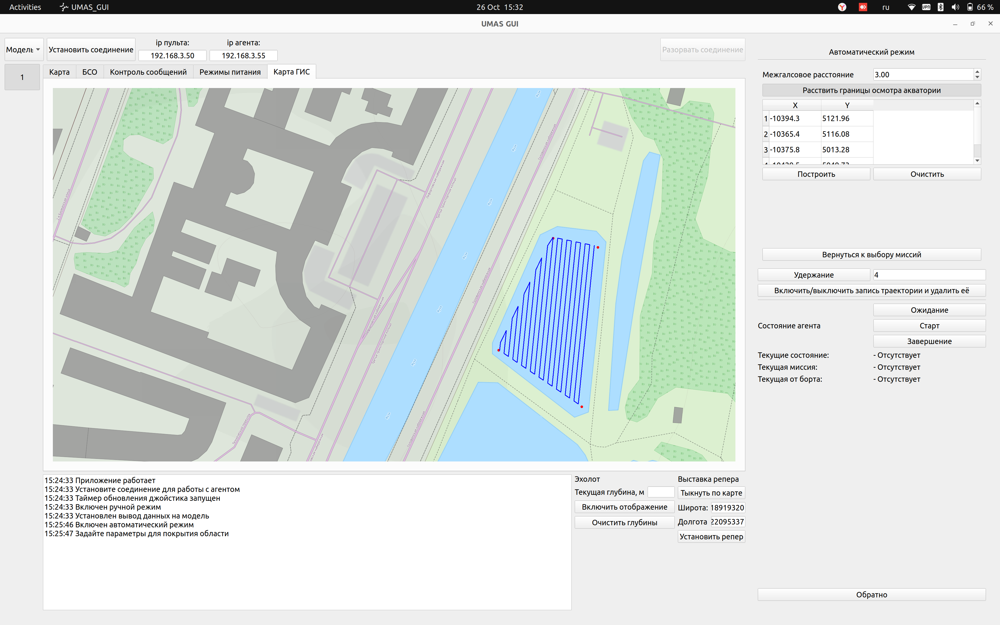

# UMAS_GUI

Проект — операторский пульт управления подводными аппаратами. Qt-приложение, которое взаимодействует с бортовой системой через ROS 2: получает телеметрию/видео, визуализирует состояние и отправляет управляющие команды.

Пример GUI при планировании миссии


Архитектура взаимодействия с ROS 2
- RosBridge (ros2_bridge/RosBridge) работает в отдельном QThread и инициализирует rclcpp::Node с namespace "qt_controller".
- Публикации:
  - geometry_msgs::msg::Twist → /control/data (управляющие команды)
  - std_msgs::msg::UInt8 → /control/loop_flags (флаги режимов управления)

Сборка и запуск
Рекомендуется использовать контейнеры, скрипты уже подготовлены в ./docker.

Быстрый запуск готового Docker-образа:
```bash
# Bash
docker pull hydronautics/umas-gui
./docker/run_image.sh
```

После этого приложение стартует сразу: бинарник уже собран внутри образа.
Если нужно временно запустить другой образ:
```bash
# Bash
DOCKER_IMAGE=<dockerhub-user>/umas-gui ./docker/run_image.sh
```

Локальная dev-схема с монтированием исходников:

1) Собрать образ:
```bash
# Bash
./docker/build_docker.sh
```

2) Запустить контейнер (среда выполнения):
```bash
# Bash
./docker/run_docker.sh
```

3) Скомпилировать приложение (в контейнере ):
```bash
# Bash
./docker/compile_app.sh
```

4) Запустить приложение:
```bash
# Bash
./docker/run_app.sh
```

Публикация Docker-образа через GitHub Actions
- Workflow: `.github/workflows/docker-image.yml`
- Запускается при push в `main`/`master`, при push git-тега `v*.*.*` и вручную через `workflow_dispatch`.
- По умолчанию публикует образ в Docker Hub как `hydronautics/umas-gui`.
- Теги: `latest` для default branch, имя ветки, git tag, `sha-<commit>`.

В настройках GitHub репозитория нужно добавить:
- Secret `DOCKERHUB_USERNAME` — имя пользователя Docker Hub.
- Secret `DOCKERHUB_TOKEN` — Docker Hub access token.
- Optional Repository Variable `DOCKERHUB_REPOSITORY` — полное имя образа, если нужно переопределить `hydronautics/umas-gui`.

Альтернативно (локально, при наличии ROS 2 и Qt):
- В рабочей директории ROS 2 workspace:
```bash
# Bash
colcon build --packages-select UMAS_GUI
source install/setup.bash
# или стандартный CMake-подход:
mkdir build && cd build
cmake .. && make -j$(nproc)
```

Структура проекта (ключевые папки/файлы)
- CMakeLists.txt, package.xml — сборка и зависимости
- docker/ — скрипты сборки и запуска
- main.cpp, mainwindow.* — точка входа и главный UI
- ros2_bridge/ — RosBridge (rclcpp ↔ Qt)
- input/ — адаптеры источников ввода (gamepad, клавиатура)
- remote_control/ — joystick/keyboard helpers
- control/ — control_service (применение команд)
- uv/ — UVState (центральная модель состояния аппарата)
- compass/, map/, Diagnostic_bord_UI/ — дополнительные UI-модули
- Gamepad/, mods/ — вспомогательные модули и режимы
